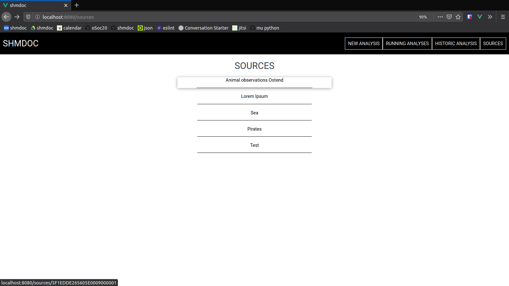

# Shmdoc PoC application

Shmdoc is a tool that allows for a combination of automated and human-supplied analysis as well as annotation of scientific datasets.
It was developed as a proof of concept application for [VLIZ](http://www.vliz.be/) during [Open Summer of Code](http://www.osoc.be) 2020.

## Overview
### Features

* Automated **analysis** of `.xml`, `.json` and `.csv` files.
* Human-supplied **annotation** of the unit of certain fields through an easy-to-use **web interface**.
* Data stored as **triples** for linked-data/semantic analysis capabilities.
* Extensible microservices software stack based on the [**mu.semte.ch** framework](https://mu.semte.ch/).

### Architecture
Shmdoc is a microservices-based application, meaning that the different parts of the application are contained in different entities that can each have their own independent implementation and dependencies.
These contained entities are called microservices, and they communicate with each other via HTTP.

Shmdoc is built with the [mu.semte.ch framework](https://mu.semte.ch/) which means that microservices are contained in **Docker containers**.
Management of the different microservices is done with `docker-compose`.

### Overview of microservices


Shmdoc consists of a few microservices. Some were already available in the mu.semte.ch framework. Others were built specifically for shmdoc.
* [`db` ](https://github.com/tenforce/docker-virtuoso): the database is the heart of this application. The `db`-service is the central location for all data storage.
* [`migrations`](https://github.com/mu-semtech/mu-migrations-service): service to import existing databases in the `db` service. This service can for example be used to import existing vocabularies into the database (as is done for the units vocabulary in this proof of concept.)
* [`resources`](https://github.com/mu-semtech/mu-cl-resources): The resources service allows the database to be accessed by a JSON-API, as is done by the `frontend` service.
It is configured by `/config/resoures/domain.lisp`.
* [`file-service`](https://github.com/mu-semtech/file-service): The `file-service` allows for file upload and download from the `db`-service. This service is used to upload files for analysis in this proof of concept.
* [`identifier`](https://github.com/mu-semtech/mu-identifier): A HTTP proxy that identifies the user-agent and makes sure that all user-agents behave as expected. It basically makes sure that browsers play nice with the services.
* [`dispatcher`](https://github.com/mu-semtech/mu-dispatcher): The `dispatcher` service dispatches HTTP requests that are sent to the application. The service is configured in `config/dispatcher/dispatcher.ex` as stated [here](https://github.com/mu-semtech/mu-dispatcher#Configuration).

built for shmdoc:

* [`shmdoc-analyzer`](https://github.com/shmdoc/shmdoc-analyzer-service): service that fetches files from the `db` service for automatic analysis.
* [`frontend`](https://github.com/shmdoc/frontend-shmdoc-osoc-poc): service that provides a front-end for our application. It accesses all services in a user-friendly way.

## Running the app yourself

### Requirements
To run this application you, must install:
- [Docker](https://docs.docker.com/engine/install/)
- [Docker compose](https://docs.docker.com/compose/install/)

### Configuring your environment

This repository provides a main `docker-compose.yml`-file, as well as some environment-specific compose files. You'll want to create a `.env`-file with that contains the following line:
```
COMPOSE_FILE=docker-compose.yml:docker-compose.prod.yml
```
### Starting the stack
After the requirements have been installed and the environment has been set start the stack with:
```
docker-compose up
```
With the standard production settings, you can now open up a browser and browse to `localhost` where you will be presented with the user interface.

See docker-compose's [cli-reference](https://docs.docker.com/compose/reference/overview/) for more information regarding the management of these kind of stacks.

## Running the app for Development

When running the app for development, you might want to alter your
environment configuration. It is recommended to use an [Environment File](https://docs.docker.com/compose/env-file/) (aka `.env`-file)

For development the `.env` can look like this:
```
COMPOSE_FILE=docker-compose.yml:docker-compose.dev.yml
```
The configuration in the `docker-compose.dev.yml` file will overwrite some standard settings for the specified microservices.
* [Specific information for the `shmdoc-analyzer` service](https://github.com/shmdoc/shmdoc-analyzer-service#development-environment)
* [Specific information for the `frontend` service](https://github.com/shmdoc/frontend-shmdoc-osoc-poc)

The `docker-compose.dev.yml` file provided in this repository as an example will do the following things:
* Disable the `frontend` service altogether.
* Route port `80` to the identifier to skip the disabled `frontend`.
* Expose port `8890` to access the database directly via the `SPARQL`-endpoint at `localhost:8890/sparql`.
* Expose the `shmdoc-analyzer` service for easy debugging at port `8891`.

After your environment is configured you can start the code just like with the production environment settings:
```
docker-compose up
```

## Documentation

### API-specification generation

The [OpenAPI resources generator](https://github.com/mu-semtech/cl-resources-openapi-generator) can be used to generate an [openapi](https://www.openapis.org/)-specification for the API exposed by `resources`.  
Following command will generate a `openapi.json`-file in `./doc`. Make sure to delete the old one should a file by this name already exist.
```
docker-compose -f docker-compose.yml -f docker-compose.doc.yml up
```

### User documentation

Here you can find an introduction on getting started with shmdoc.
We're assuming your IT-administrator has already setup shmdoc somewhere, e.g. at `localhost/` or `shmdoc.osoc.be`. 

#### Tutorial: Creating and viewing analysis jobs

Let's take a look at what you can do with shmdoc. In this tutorial you'll learn how you can create a source, upload a file and how you can view/edit the information about the columns in the file.

Let's start by going to the webpagee were shmdoc is hosted.
The shmdoc home page let you create new analysis, view running analysis, view historic analysis and get an overview of your running pages. 


Let's start by creating a new analysis. 

Every analysis is attached to a source. A source is used to group similar analysis. Hit "Created new source" to create a new one. Enter the name and a small description and press "Create source".


Now we can upload a file to this source: Choose a file, selected the file you want. Be sure the name of the source you want to upload to is in the input field next to the "Upload job". You can also choose multiple files and upload them all at once to the same source. Once this is done, upload your job. 


Once the file has been uploaded, it will show in the running analysis overview page. It might take some time before the file appears or the running completes, depending on how large your file is. 


Once your job is done, you can go to the shmdoc homepage (by clicking on "shmdoc" in the upper left corner). You can find your analysis result under "Historic analyses", but it's recommended to navigate to your analysis results by clicking "Sources" on the homepage and then clicking on the name of the source you've added your analysis job to. (The "Historic analyses" list can get quite long over time).



Click on the source you've just added your analysis job. Then you can see an overview of all analysis jobs connected to the source. Click on the one you've uploaded and you can see an overview of the results from the analysis.
Fun fact: You can also add a new analysis job to a source from the page with an overview of all jobs of the source.


The overview of the analysis results is column per column. You can change the column you're viewing the results for by clicking on "Columns" in the upper left corner and clicking on the column you want to see.


Shmdoc has done it's job. Now it's time for a human to complete the results. You can do this by clicking on "edit" and adding the extra info you'd like. Let's say we want to add "Years" as the unit of this column. Once entered, hit "save" and you can see your unit property has been updated. 


Finally, you can take a look at columns from all analysis containing the same unit by clicking on "Show related" in the row of the unit property. Clicking on one of those brings you to the page for that column information.


